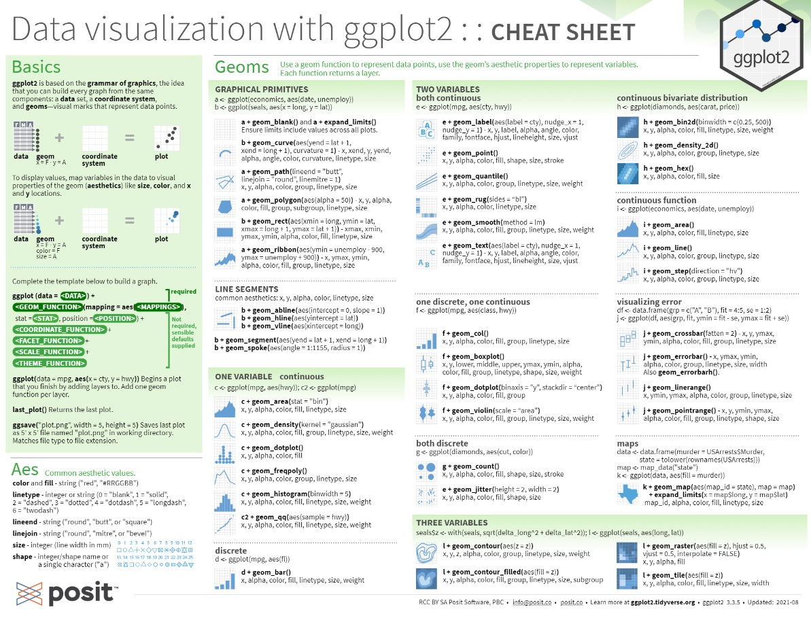
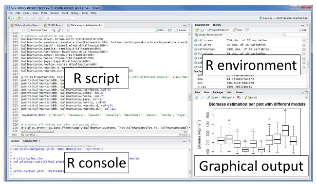
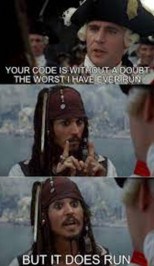

```{r setup, include=FALSE}
knitr::opts_chunk$set(echo = TRUE)
```

## Agenda {.tabset .tabset-fade .tabset-pills}

+ Getting Started with R Programming
+ R_Basico_1.0
+ R_Basico_1.1
+ R_Basico_1.2
+ R_dplyr
+ R_ggplot
+ Bonus


&nbsp;

### Getting Started with R Programming

`OBJETIVO:` **Breve historia de R y contexto**

&nbsp;

#### Historia de R

&nbsp;

Ross Ihaka and Robert Gentleman desarrollaron `R` como un software *free* cuando impartían clases en la Universidad de Auckland en New Zealand a principios de 1990. 

Lo crearon a partir del lenguaje estadístico denominado `S` y para diferenciar su trabajo usaron una sintaxis similar para su propio uso. En 1993 anunciaron su colaboración en las noticias del mailing list de `S`, muchas personas se interesaron y se sumaron a la colaboración. Dicha colaboración sigue en pie en el sitio https://www.r-project.org/ 

El lanzamiento oficial (1.0.0) fue en Febrero del 2000, para ese entonces ya era parte de la fundación de software libre GNU. Actualmente la última versión (3.6) está disponible desde Abril de este año para más de 30 países.

&nbsp;

#### Ventajas y usos de R

&nbsp;

Es un software que ayuda a la manipulación de datos, cálculos aritméticos y visualización de gráficos dinámicos. 

El código es de fácil escritura y comprensión.

Excelente para el cálculo de matrices, vectores, algoritmos complejos.

Existe una colección muy amplia de herramientas para el análisis de datos, visualización y otros propósitos. `dplyr`, `data.table`,  `tidyr` y `ggplot2` algunos de ellos.

Fácil desarrollo de herramientas con buen nivel de interacción como `blogdown` y `xaringan`.

&nbsp;

#### Iniciando

&nbsp;

Para descargar e instalar `R` en su última versión, deberán utilizar el siguiente link https://cran.r-project.org/bin/windows/base/  donde encontraran la versión para Windows que es el sistema operativo que todos tenemos.

Un lenguaje amigable, fácil de usar y entender, simple y efectivo.

Con `R` se distribuyen algunos paquetes, pero existen muchos más en el sitio CRAN, cubriendo así un amplio espectro de herramientas estadísticas, de cálculo y de visualización que les harán más divertida la vida.

En los próximos días les hare llegar documentos como estos, los cuales les serán de gran apoyo con cosas básicas, no podemos retener todo en la memoria, además de que cubriremos muchos comandos, ejemplos y funciones de las paqueterías.


&nbsp;

```{r echo=F, out.width = '50%'}

```

&nbsp;

Para las siguientes sesiones usaremos una interface muy "Fancy" denominada RStudio, la cual podrán descargar en el siguiente link https://www.rstudio.com/products/rstudio/download/ que los llevara a tener la versión más reciente.

Existen más programas o UI´s muy padres, Anaconda (luego revisan el siguiente link) https://www.anaconda.com/distribution/ tiene excelentes herramientas con Python y aun para R. También existe Visual Estudio, lo platicamos un poco en sesiones anteriores, recuerdan?, sin embargo una de las mejores herramientas con R es RStudio. 

&nbsp;

##### *Están listos?*


### R_Basico_1.0

`OBJETIVO:` **Vistazo de Rstudio y primeros comandos**

&nbsp;

Recordando...

*R es un lenguaje computacional diseñado para la estadística.* 

* Es gratis
* Amplias librerias
* Basto soporte, mailing list, blogs, tutoriales
* De facíl desarrollo
* Desarrolado por estadísticos

&nbsp;

Recuerden que cualquier cosa que escriban en R muy probablemente no seran los primeros en intentarlo, hay una gran posibilidad que alguien ya haya escrito  algun paquete justo para lo que necesitan.

Hecharemos un vistazo a la parte basica de RStudio que nos permitira entender el funcionamiento del lenguaje, sus alcances, sus aplicaciones y sus ventajas sobre las herramientas actuales que conocemos.

&nbsp;

```{r echo=F, out.width = '70%'}

```

&nbsp;

Inicien RStudio y abran un R script:

* En Windows click en el boton de Inicio y busquen Rstudio.
* Ya en Rstudio den click en  `File -> New File -> R script` 
* Guardenlo en su carpeta del curso  `File -> Save As -> ruta a su carpeta y nombre del file`

Ahora traten de reproducir las siguientes notas.

Nota. Recuerden el simbolo `#` para comentar su codigo. 
  
&nbsp;

**FORMAS DE DECLARAR Ó GUARDAR Ó ALMACENAR Ó MANTENER VARIABLES:**
```{r }
x = 3
y <- 4
5 -> z
```

**Asi estan almacenadas en el ambiente:**

```{r }
x
y
z
```

Nota. Los valores que guardamos pueden ser usados en subsecuentes operaciones, recuerden que lo mas limpio es poner el nombre a la izquierda y los valores a la derecha.

&nbsp;

**SOBRESCRIBIR VARIABLES:**
```{r }
x = 4
y <- 5
6 -> z
```

**Asi estan almacenadas en el ambiente:**

```{r }
x
y
z
```

**CALCULOS BASICOS:**

Operadores
```{r ,warning=F, error=F, message=F}
#SUMAS
25+25
x+y
#MULTIPLICACIONES
35*2
#DIVISIONES
x/y
#RESTAS
z-x-y
#Potencias
3^2
y^x
```

**CALCULOS BASICOS**

FORMAS DE **NO** HACER CALCULOS BASICOS, ASI NO ES LA SINTAXIS DE R:
```{r ,warning=F, error=F, message=F}
#SUMAS
#=25+25

#MULTIPLICACIONES
#(35)(2)
```

**VECTORES**

```{r }
#Basicos
x <- c(1,4,3,1,3,2,2,2)
x[1]
x[2]
x[2:4]
x[-1]
x[-4]
x[x<=3]
#Función which (más adelante veremos, for, while, ifelse)
#Devuelve la posición del elemento que pidamos validar.
which(x==1)
#Quizá con el alfabeto es más claro.
which(letters == "g")
x==1
#Mas complejos con operaciones, guardamos vectores
Cebollas.huacal <- c(12,4,4,6,9,3)
Chiles.caja <- c(5,3,2,2,12,9)
#Multiplicamos vectores
Cebollas.precio <- Cebollas.huacal *200
Chiles.precio <- Chiles.caja *100
#Sumamos vectores
Cebollas.precio + Chiles.precio
#Tambien lo podemos hacer asi en 1 sola linea
Cebollas.huacal *200 + Chiles.caja *100
```

**OBJETOS**

```{r }
objeto <- 3*3
```

**FUNCIONES**
```{r }
myfun = function(x, y){
  return (x*y)
}
myfun(3,4)

myfun2 = function(x, n=2){
  return(x^n)
}
myfun2(4)
myfun2(2, n=3)
```

**R LOOP´S** (While - For)

Sintaxis *WHILE*:

<style>
div.blue { background-color:#e6f0ff; border-radius: 5px; padding: 20px;}
</style>
<div class = "blue">

while (test_expression){
  statement
  }

</div>

&nbsp;

```{r }
i <- 1
while (i < 6) {
  print(i)
  i = i+1
  }
```
&nbsp;

Sintaxis *FOR*:

<style>
div.blue { background-color:#e6f0ff; border-radius: 5px; padding: 20px;}
</style>
<div class = "blue">

for(var in seq){
  expr
  }

</div>

&nbsp;


```{r }
for (año in c(2014,2015,2016,2017,2018,2019)){
  print(paste("El año actual es", año))
}
```
&nbsp;

Aún mejor...

```{r }
for (año in 2014:2019){
  print(paste("El año actual es", año))
}
```
&nbsp;

lo ideal...

```{r }
años <- c(2014,2015,2016,2017,2018,2019)
for (i in años){
  print(paste("El año actual es", i))
}
```
&nbsp;

**R FUNCTION´S**  (Ifelse - Which)


Sintaxis *IFELSE*:

<style>
div.blue { background-color:#e6f0ff; border-radius: 5px; padding: 20px;}
</style>
<div class = "blue">

ifelse(test, yes, no)

</div>

&nbsp;


```{r }
plazo <- c(6,9,12,24,30)
ifelse(plazo==9, "aplica" , "no aplica")
```
&nbsp;

más divertido...

```{r }
plazo <- c(6,9,12,24,30)
ifelse(plazo>=9 & plazo<=24, "aplica" , "no aplica")
```
&nbsp;

Sintaxis *WHICH*:

<style>
div.blue { background-color:#e6f0ff; border-radius: 5px; padding: 20px;}
</style>
<div class = "blue">

which(x, arr.ind = FALSE, useNames = TRUE)

</div>

&nbsp;


```{r }

which(letters == "g")

```

&nbsp;

### R_Basico_1.1

`OBJETIVO:` **Como cargar datos, paquetes y librerias**

&nbsp;


Cargando nuestros datos

R tiene algunas formas de leer archivos, los mas comunes son tablas, archivos planos, archivos con alguna codificacion especifica o estructurada. Aunque no sera el objetivo del curso, leer cadenas de texto, datos sin estructuras definidas o espcificas y archivos sin algun tipo de orden, es algo que tambien se puede hacer en R. 

Para leer datos de un archivo, primero deben saber que tipo de archivo es, es decir, su extension. La tabla de abajo muestra una lista de funciones que pueden ser importadas segun el formato del archivo.

&nbsp;

  tipo de datos                 funcion         paquete 
  ------------------------- ---------------  --------
  comma separated (.csv)    `read_csv()`     readr
  other delimited formats   `read_delim()`   readr
  R (.Rds)                  `read_rds()`     readr
  Stata (.dta)              `read_dta()`     haven   
  SPSS (.sav)               `read_spss()`    haven   
  SAS (.sas7bdat)           `read_sas()`     haven   
  Excel (.xls, .xlsx)       `read_excel()`   readxl  
  regular delimited files   `fread()`        data.table 


Nota. Mas información ver documento de apoyo `data-import`

&nbsp;

Paqueterias de R ó los famosos *packages*

Los paquetes de R pueden ser instalados desde el famoso CRAN, el cual es una red de archivos de alta gama. Para ello deberán  usar la función `install.packages`. Cuando instalan un paquete ponen una copia en la computadora de forma local, pero aun no lo hace "usable", solo esta "disponible". Para usarlo deberan adjuntar o cargar la funcion de `library`.

Gracias a nuestro amigo Hadley y otros colaboradores, en este curso usaremos para prueba de carga el famoso "the tidyverse". `Tidyverse` nos brinda grandes herramientas para manipulación basica y avanzada de datos, es muy funcional, facíl e intuitiva. 

&nbsp;

```{r, eval=FALSE}
install.packages("tidyverse")
```
```{r}
library(tidyverse)
```

&nbsp;

Nota. Activar la ayuda en `R`:

Podemos usar la función `help` o el operador al inicio de cada sentencia `?`.

```{r}
#help(help)
#?str
```

&nbsp;

Cargando nuestro primer archivo:

```{r}
#read_csv("path a un csv/EJEMPLO_CARGA.csv")
```

UPS!! Problemas!!!

&nbsp;

Hagamos que este disponible la libreria...

```{r}
library(readr)
read_csv("data/Market_size.csv")
```
¿Qué pasa aquí?, este tipo de issues es muy común, es necesario saltar algunos renglones hasta llegar al encabezado...

&nbsp;

```{r}
library(readr)
read_csv("data/Market_size.csv", skip = 5)
```
&nbsp;

```{r}
market <- read_csv("data/Market_size.csv", skip = 5, n_max = 5)
market
```

Solo leemos las primeras 5 filas/rows, revisen los atributos de la función `read_csv`.

&nbsp;

Ahora lo mismo pero con otra libreria muy poderosa, de las preferidas de los estadisticos!!!

```{r warning=F}
#install.packages("data.table")
library(data.table)
market_ <- fread("data/Market_size.csv", skip = 5, sep = ",", header = T)
head(market_,5)
```

&nbsp;

Ahora validamos ó exploramos los datos que cargamos en el ambiente con las siguientes funciones estadísticas

```{r}
class(market_)
```

&nbsp;

Podemos obtener aún más

```{r}
library(dplyr)
glimpse(market_)
```

&nbsp;

Un poco más

```{r}
str(market_)
```

&nbsp;

la mejor información!!!

```{r}
summary(market_)
```

&nbsp;

¿Llegaste hasta aquí? Felicidades, podemos avanzar y subir el volumen!!!


&nbsp;


```{r echo=F, out.width = '50%'}

```


### R_Basico_1.2

`OBJETIVO:` **Manejo de datos**

&nbsp;

Normalmente los datos en R son almacenados como `data.frame`

Un data.frame es una lista de vectores de la misma longitud, piensenlos como una tabla de observaciones (individuos), cada entrada del vector en la lista forma una columna, cada columna puede ser de diferente tipo, conocemos a las columnas como variables y a las filas como observaciones.

Un data.frame tiene entonces dos dimensiones correspondientes al numero de filas y columnas, en ese estricto orden. 

Empezaremos a hacer nuestros primeros subsets, muy utiles en la vida real.

&nbsp;

Empezamos con un clasico, `filter`

```{r}
filter(market_, Geography == "USA" & Category == "Energy Drinks")
```

&nbsp;

Otra forma de filtrar con `in`... ¿encuentran parecido con algo?

```{r}
filter(market_, Geography == "USA", Category %in% c("Carbonates", "Concentrates"))
```

&nbsp;

Buen acceso a ciertas observaciones, `slice`

```{r}
slice(market_, 1:5)
```
¿Que pasó aqui?

&nbsp;

```{r}
head(slice(market_,-c(1,2)))
```

&nbsp;

Revisemos con un `head` y un `tail`

```{r}
head(market_)
```
```{r}
tail(market_)
```

&nbsp;

Entonces `slice` y `filter` se usan para extraer algun tipo de "observación, row, fila, value, entrada, etc.", de la misma forma usamos `select` para acceder a las columnas.


```{r}
select(slice(market_, 1583:1609), c("2021", "2022", "2023"))
```

¿Que pasó aqui?, expliquenme chic@s list@s!!!

&nbsp;

...podemos usar algo super util como el simbolo de `$`, el cual nos ayudara a acceder a una columna especifica de un df, ojo, primero cambiamos el tipo de dato, después podemos ejecutar cualquier calculo removiendo los NA que se introducen por default. 

```{r}
market_$"2017" <- as.numeric(market_$"2017")
sd(market_$"2017",na.rm=T)
```
o tambien...
 
```{r}
mean(market_$"2017",na.rm=T)
```
&nbsp;


### R_dplyr

`OBJETIVO:` **Pipes, datos en forma tidy y verbos de la librería**

&nbsp;

Sigan cuidadosamente las siguientes instrucciones, inicien RStudio y generen un nuevo proyecto:
  
* En Windows click en el botón de Inicio y busquen Rstudio.
* Ya en Rstudio den click en  `File -> New Project... -> Existing Directory -> Browse... -> seleccionar carpeta destino -> Open -> Create Project` 
* Ya que se abre otra pantalla de R, dar click en  `File -> New File -> R script` 
* Guárdenlo en su carpeta del Proyecto nuevo que acabamos de crear.  `File -> Save As -> ruta a su carpeta y nombre del file`
* Instalen `dplyr`(en caso de no tenerlo aún)
* Iniciemos con lo siguiente:
  
&nbsp;


Debemos cargar el archivo *Pack_type* con varias pestañas, contribucion de nuestro amigo LEE.

De la siguiente forma cargamos 1 sola pestaña, pero no es la escencia de esto.
```{r results="hide", error=FALSE, message=FALSE, warning=FALSE}
library(dplyr)
library(readxl)
pestaña <- read_excel("data/Pack_type.xls", sheet = 1)
head(pestaña)
```
&nbsp;

Revisamos de la siguiente manera las pestañas y seleccionamos la que queremos revisar.
```{r error=FALSE, message=FALSE, warning=FALSE}
#recuerden que el path de cada equipo es diferente
ruta <- "data/Pack_type.xls"
excel_sheets(path = ruta)
```
Ojo. Muestra inclusive las pestañas que esten ocultas.

&nbsp;

Cargamos el archivo y la pestaña deseada:
```{r error=FALSE, message=FALSE, warning=FALSE}
pack_type <- read_excel(path = ruta, sheet = "Statistics Data", skip = 5)
head(pack_type)
```
&nbsp;

Revisamos los datos:
  
```{r error=FALSE, message=FALSE, warning=FALSE}
summary(pack_type)
```
&nbsp;

**Verbos de `dplyr` que usaremos:**
  
* mutate() adds new variables that are functions of existing variables
* select() picks variables based on their names.
* filter() picks cases based on their values.
* summarise() reduces multiple values down to a single summary.
* arrange() changes the ordering of the rows.

Provided by https://dplyr.tidyverse.org/

(Nota, en ese link hay un cheat sheet muy bueno de "Data transformation")

&nbsp;

#### **Atención!!!... usaremos un simbolo muy curioso para manipulación de datos con Dplyr, mejor conocido como *operator* (%>%)** 
  
&nbsp;

¿Están listos chic@s?

```{r echo=F, out.width = '50%'}

```

&nbsp;

Iniciamos con el verbo `mutate()`, el cual nos genera una nuevas variables a partir de otra dada que cumpla cierta condición. En este ejemplo modificamos las variables que son `char` a `numéricas`:

```{r error=FALSE, message=FALSE, warning=FALSE}
pack_type_moded <- pack_type %>%
  mutate(across(7:13, as.numeric))
```

&nbsp;

Revisamos como quedo el nuevo dataset.

```{r error=FALSE, message=FALSE, warning=FALSE}
head(pack_type_moded)
```
&nbsp;

Aquí otro ejemplo muy util para generar variables calculadas de la diferencia del crecimiento/decremento del 2023 vs 2022:

```{r error=FALSE, message=FALSE, warning=FALSE}
pack_type %>%
  mutate(across(7:13, as.numeric)) %>%
  mutate(Year_diff= ((`2023` / `2022`)-1)*100)
```
&nbsp;

Mejorando:

```{r error=FALSE, message=FALSE, warning=FALSE}
pack_type %>%
  mutate(across(7:13, as.numeric)) %>%
  mutate(Year_diff= paste0(round(((`2023` / `2022`)-1)*100,2),"%"))
```
&nbsp;

Ahora revisamos que hace el verbo `select()`.

¿Encuentras algun parecido a cursos anteriores?

```{r error=FALSE, message=FALSE, warning=FALSE}
pack_type %>%
  select(c("Geography","Category","2022","2023")) %>%
  mutate(across(3:4, as.numeric)) %>% #ojo aquí, los indices cambian al recortar el no. de columnas
  mutate(Year_diff= paste0(round(((`2023` / `2022`)-1)*100,2),"%")) 
```

&nbsp;

Podemos obtener el nombre de nuestras columnas para identificarlas mas facilmente...

```{r error=FALSE, message=FALSE, warning=FALSE}
colnames(pack_type_moded)
```

&nbsp;

No guardamos lo siguiente en la variable, solo observen que pasa.

```{r error=FALSE, message=FALSE, warning=FALSE}
pack_type %>%
  select(ends_with("Type")) %>%
  head()
```
&nbsp;

Y el verbo `filter()` similar al que ya habiamos visto, ojo, esto es **Dplyr**!!.

```{r error=FALSE, message=FALSE, warning=FALSE}
pack_type %>%
  filter(Geography  == "Mexico", `Pack Type` %in% c("Glass","Glass Bottles","Glass Jars"))
```

&nbsp;

El siguiente verbo `summarise()` es de gran utilidad, lo usaremos mucho, esperen a que lleguemos al mundo visual de `ggplot`.

Tenemos la variable **dist_pais** que tiene la extracción del numero de registros por pais, la usamos.

```{r error=FALSE, message=FALSE, warning=FALSE}
dist_pais <- pack_type %>%
  group_by(Geography) %>%
  summarise(cuenta = n())
```

&nbsp;

```{r error=FALSE, message=FALSE, warning=FALSE}
dist_pais
```
&nbsp;

Y por ultimo un verbo para ordenar o acomodar nuestros valores muy usado es `arrange()`

Acomodamos por forma "descendente"...

```{rerror=FALSE, message=FALSE, warning=FALSE}
dist_pais %>%
  arrange(desc(cuenta))
```

&nbsp;

Y luego "ascendente"...

```{r error=FALSE, message=FALSE, warning=FALSE}
dist_pais %>%
  arrange(cuenta)
```


&nbsp;

Comando extra y util. Quitamos espacios feos de los nombres de columnas:

```{r error=FALSE, message=FALSE, warning=FALSE}
names(pack_type) <- gsub(" ", "_", names(pack_type))
colnames(pack_type)
```
&nbsp;

**...y la magia de `dplyr` es:          un solo PIPE!!!!!**

```{r error=FALSE, message=FALSE, warning=FALSE}
pack_type %>%
  mutate(across(7:13, as.numeric)) %>%
  mutate(Year_diff= paste0(round(((`2023` / `2022`)-1)*100,2),"%")) %>%
  select(c("Geography","Pack_Type","2022","2023", "Year_diff")) %>%
  filter(Geography  == "Mexico") %>%
  group_by(Pack_Type) %>%
  summarise(Diff = `2023` - `2022`,
            Year_diff)
```

&nbsp;

Dejamos todas los paises, lo guardan en su variable y listo!!!
  
```{r error=FALSE, message=FALSE, warning=FALSE}
crecimiento_tipo_empaque <- pack_type %>%
  mutate(across(7:13, as.numeric)) %>%
  mutate(Year_diff= paste0(round(((`2023` / `2022`)-1)*100,2),"%")) %>%
  select(c("Geography","Pack_Type","2022","2023", "Year_diff")) %>%
  group_by(Pack_Type) %>%
  summarise(Diff = `2023` - `2022`,
            Year_diff) %>%
  na.omit() %>%
  arrange(Year_diff)
crecimiento_tipo_empaque
```

&nbsp;

Aplausos!!!

&nbsp;


### R_ggplot

`OBJETIVO:` **Graficar entendiendo los datos, escalas y tipos de gráficos, mejorar visualizaciones actuales**

Para esta sección de visualización, pueden buscar referencias como [esta](
https://infogram.com/es/pagina/visualizacion-datos), que nos brindan un contexto apropiado de lo que representan los datos.


```{r error=FALSE, message=FALSE, warning=FALSE}
#Quitamos las comas y redondeamos la cifra, ademas que guardamos la variable como entero
library(readr)
market <- pack_type %>%
  mutate(`2022` = parse_number(`2022`))
#parse_number esta dentro de readr
```
&nbsp;

revisamos de nuevo:

```{r error=FALSE, message=FALSE, warning=FALSE}
str(market)
```

&nbsp;

Ahora si pudieron cargar `tidyverse` solo habiliten la libreria.

```{r}
library(ggplot2)
```

Si *NO* pudieron cargar `tidyverse`, descarguen `ggplot2` y habiliten la libreria.

```{r, eval=FALSE}
install.packages("ggplot2")
library(ggplot2)
```

&nbsp;

Ventajas de `ggplot2`:

 + Muy flexible
 + Fácil de interpretar, sintaxis sencilla
 + Sistema ya muy avanzado para graficar
 + Ecosistema amplio
 + Comunidad amplia, gran soporte
 + Basado en el libro "The Grammar of Graphics"

&nbsp;

¿Cómo se usa?

Empezamos con la función ggplot(), integrando nuestra base y sus variables (con aes()). Luego agregamos las coordenadas o puntos a graficar con geom_point() o con  geom_histogram(), luego las escalas ó colores (como puede ser scale_colour_brewer()), algunas especificaciones como  facet_wrap() y hasta títulos o marcas.

&nbsp;

¿Y si graficamos con R base?  `ggplot2` VS R base de una manera muy sencilla.

```{r echo=F, warning=F, error=F, message=F}
#Cargamos datos
market <- read_csv("data/Market_size.csv", skip = 5)
market<- market %>%
  mutate(across(6:12, as.numeric))
```


```{r , warning=F, error=F, message=F}
hist(market$`2023`)
```
&nbsp;

Y con `ggplot2` se ve lo mismo de la siguiente forma:

```{r , warning=F, error=F, message=F}
ggplot(market, aes(x = `2023`)) +
  geom_histogram()
```

Sin embargo hay que graficar cosas que hagan sentido, pero antes revisemos un poco mas.

&nbsp;

Aesthetic Mapping

En el mundo de `ggplot2` *aesthetic* significa "algo que puedes ver". Puedes incluir las siguientes opciones:

-   position (por ejemplo en el eje x o en el eje de las y´s)
-   color (el color de relleno)
-   fill (el color del grafico)
-   shape (forma)
-   linetype
-   size (tamaño)

Cada tipo de gráfico solo acepta un conjunto de datos, es natural de una gráfica de dos dimensiones.

&nbsp;

Objetos geométricos (`geom`)

Son los tipos de gráficos que tenemos en cada imagen:

-   Puntos (`geom_point`, para scatter plots, dot plots, etc.)
-   Lineas (`geom_line`, para time series, trend lines, etc.)
-   Diagrama de caja y brazo (`geom_boxplot`)

Un gráfico al menos debe tener un objeto geométrico, y pueden ir agregando más con el símbolo `+`, que al ponerlo lo identa de manera correcta.

Puedes tener una buena ayuda con los objetos disponibles de la siguiente forma:

```{r, eval=FALSE}
help.search("geom_", package = "ggplot2")
```

&nbsp;

Pongamos datos reales...

&nbsp;

Ordenamos y hacemos un sencillo resumen...

```{r , warning=F, error=F, message=F}
market2 <- market %>%
  group_by(Category) %>%
  filter(`Current Constant` == "Current Prices") %>%
  summarise(Last_Year = sum(`2023`, na.rm=TRUE))
market2
```

&nbsp;

Y graficamos...

```{r , warning=F, error=F, message=F}
ggplot(market2, aes(y = Last_Year, x = Category)) +
  geom_point()
```
&nbsp;

Agregamos leyendas en ambos ejes y ajustamos escala

```{r , warning=F, error=F, message=F}
ggplot(market2, aes(y = Last_Year, x = Category)) +
  geom_point() +
  scale_y_continuous(limits = c(2500, 10000))+
  ylab("Volumen en precios")+
  xlab("Categoria de bebida")
```

&nbsp;

Un poco mejor...

```{r , warning=F, error=F, message=F}
ggplot(market2, aes(y = Last_Year, x = Category)) +
  geom_point() +
  geom_point(size= 6, alpha= .6) +
  scale_y_continuous(limits = c(2500, 10000))+
  ylab("Volumen en precios")+
  xlab("Categoria de bebida")
```

&nbsp;

O mejor asi...

```{r , warning=F, error=F, message=F}
ggplot(market2, aes(y = Last_Year, x = factor(Category))) +
  geom_line(aes(group=1),color="#69b3a2", size=2, alpha=0.9, linetype=2) +
  geom_point() +
  geom_point(size= 6, alpha= .6) +
  #scale_y_continuous(limits = c(2500, 10000))+
  ylab("Volumen en precios")+
  xlab("Categoria de bebida")+
  theme(axis.text.x = element_text(angle = 90, vjust = 0.5, hjust=1))
```

Sin embargo podemos hacer mejores visualizaciones con mejores datos...

&nbsp;

Volvemos a ordenar el set original, ojo con la función `gather`. 

Para mas información busquen referencias en "tidyr" relacionadas a `gather` y `spread`.

```{r , warning=F, error=F, message=F}
market <- read_csv("data/Market_size.csv", skip = 5)
market<- market %>%
  mutate(across(6:12, as.numeric)) %>%
  filter(`Current Constant` == "Current Prices")
market<- gather(market, key = "Año", value = "Prices",
       (6:12))
market
```
&nbsp;

```{r , warning=F, error=F, message=F}
market <- market %>%
  mutate(Año= as.numeric(Año)) %>%
  group_by(Category,Año) %>%
  summarise(Precios = sum(Prices, na.rm=TRUE))
market  
```

&nbsp;

y ahora si toma sentido!!

```{r , warning=F, error=F, message=F}
ggplot(market, aes(y = Precios, x = Año, colour = Category)) +
  geom_point(size= 6, alpha= .7) +
  #scale_x_continuous(limits = c(2016.5, 2023.5))+
  ylab("Precios acum")+
  xlab("Año contable")
```

&nbsp;

O mejor aun...se puede?

```{r , warning=F, error=F, message=F}
ggplot(market, aes(y = Precios, x = Año, colour = Category)) +
  geom_point(aes(size = Precios), alpha = 0.4)+
  ylab("Precios acum")+
  xlab("Año contable")+
  scale_size(range = c(0.5, 16))  #Ajusta el tamaño de los circulos
```
&nbsp;

Reordenamos datos, y permitimos tener la categoria de precios y litros.


```{r , warning=F, error=F, message=F}
market <- read_csv("data/Market_size.csv", skip = 5)
market<- market %>%
  mutate(across(6:12, as.numeric)) 
market<- gather(market, key = "Año", value = "Prices",
       (6:12))
market <- market %>%
  mutate(Año= as.numeric(Año)) %>%
  group_by(Category,`Current Constant`, Año) %>%
  mutate(`Current Constant` = str_replace(`Current Constant`, "-", "Litros")) %>%
  summarise(Precios_Lts = sum(Prices, na.rm=TRUE))
market <- market %>% spread(`Current Constant`, Precios_Lts)
market
```
&nbsp;

Hacemos algunas graficas ya un poco conocidas...

```{r , warning=F, error=F, message=F}
ggplot(market, aes(x = Año, y = Litros)) +
  geom_col(aes(color = Category, fill = Category), position = position_stack())
```
&nbsp;

de mis favoritas...

```{r , warning=F, error=F, message=F}
# Multiple line plot
ggplot(market, aes(x = Año, y = Litros)) + 
  geom_line(aes(color = Category), size = 1) +
  theme_minimal()
```
&nbsp;

Le subimos el volumen!!! Su primera regresión...

```{r , warning=F, error=F, message=F}
#Obtenemos los datos de CHEM@
emi_chema <- emision %>%
  filter(Nombre.Director == "CHEMA",
         Año.Contable != "2019") %>%
  group_by(Nombre.Director, Año.Contable) %>%
  summarise(Prima_E = sum(Emitida),
            Prima_P = sum(Pagada))
#Una regresion lineal sencilla
#Obtenemos los coeficientes
regresion <- lm(Prima_E~Año.Contable, data = emi_chema)
#Ajustamos
emi_chema$prediccion <- predict(regresion)

#De mejor interpretación
p1 <- ggplot(emi_chema, aes(x = Año.Contable, y = Prima_E))

p1 + geom_point() +
  scale_x_continuous(limits = c(2016, 2018)) +
  geom_line(aes(y = prediccion))
```


### Bonus

`OBJETIVO:` **Mostrarles que aún hay mas cosas en el universo de `R` y generar mas ideas para sus proyectos.**
